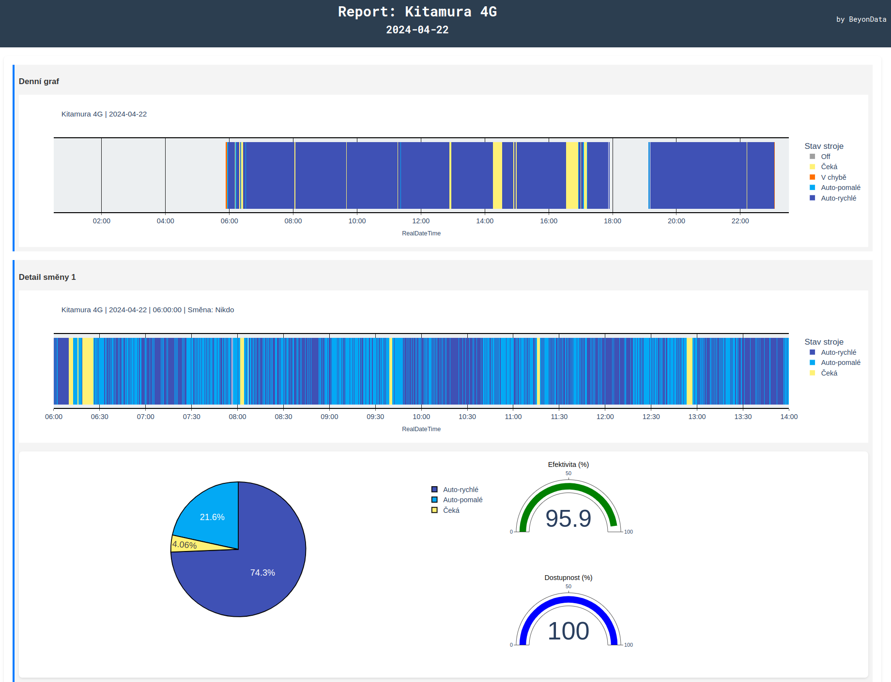
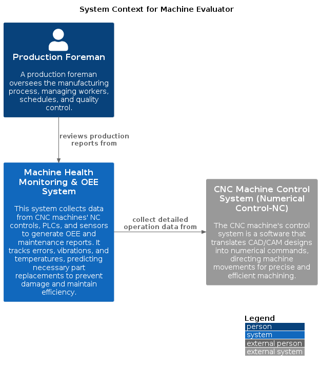
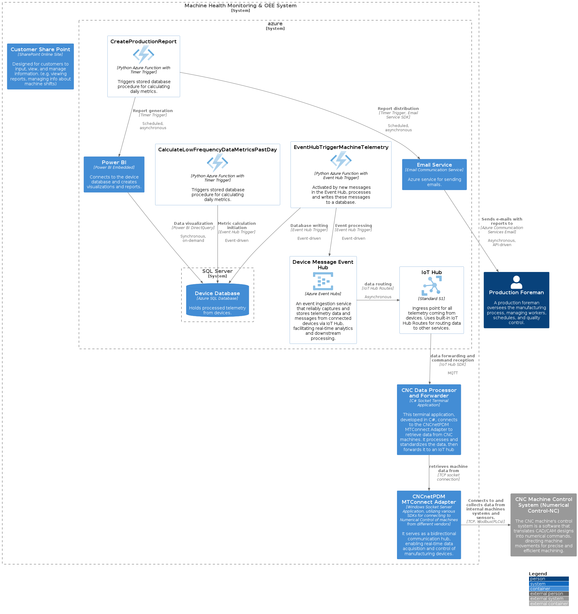

# StartupProductShowcase
Showcase of a CNC machine data collection and OEM reporting system developed for Beyondata Solutions. Includes software architecture diagrams, UI screenshots.

## UI
### Daily Report 
A daily report for production foreman which showcases the daily machine operations by shifts, the report also included all critical alarms that happened on particular machine for a particular shift.

## SW architecture
The architecture is displayed with the C4 model which displays architecture in multiple levels.
### Levels of the C4 Model

1. **System Context**:
   - Shows the system, users, and system dependencies.
   - Highlights the system's environment and high-level functionality.

2. **Containers**:
   - Displays the overall architecture and technology choices.
   - Breaks the system into deployable units and their interactions.

### System Context

### Container Context
