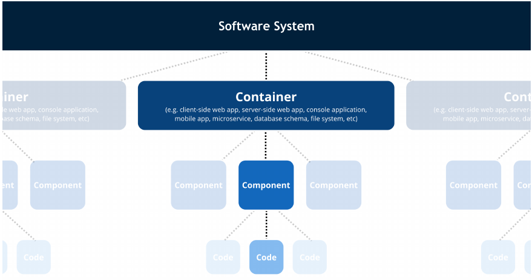
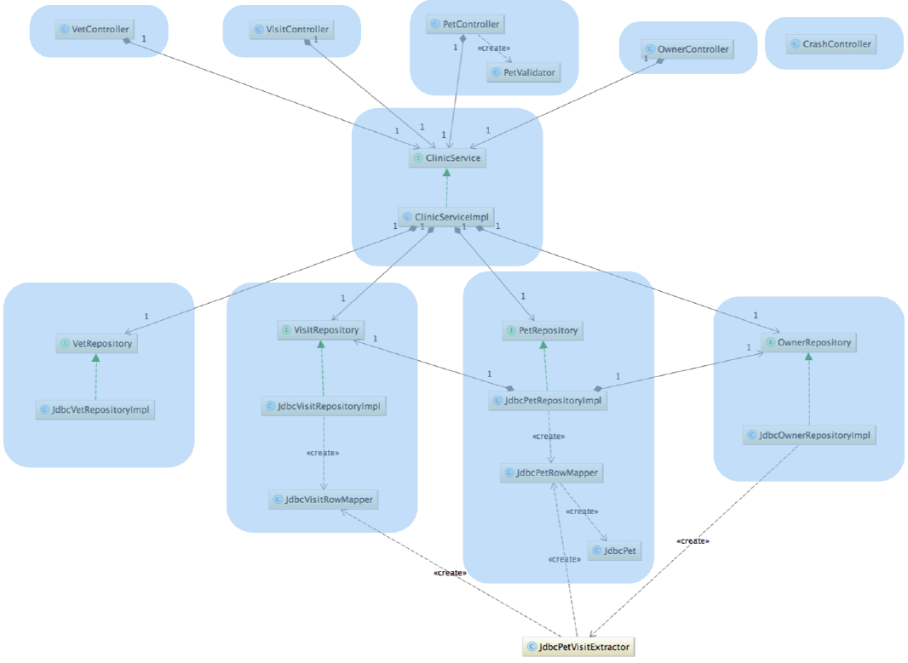
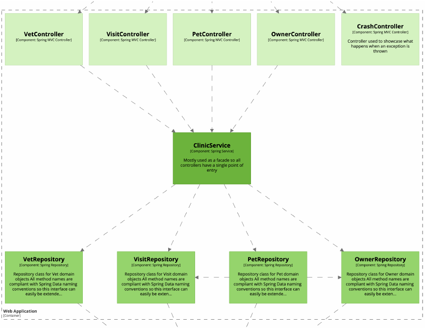

# Shared Vocabulary

## Introduction

A **shared vocabulary** aids team members in mutual understanding by **offering common abstractions and definitions** for articulating the software architecture, particularly its **static structure** (containers, components, code). This document presents a standard collection of abstractions based on the C4 Model to facilitate effective software architecture development.

The analogy for the concept of shared vocabulary is maps of the same area. Usually, two maps of the same area depict the same roads, rivers, towns, etc., despite having different notations in terms of color-coding, line styles, etc.

Software architecture diagrams serve as navigational maps for developers, but require a shared vocabulary for effective interpretation.

A **software system** is composed of one or more **containers**, such as web applications, mobile apps, desktop applications, databases, and file systems. Each container hosts a set of **components**, which represent groups of related functionality. These components are further implemented by **code elements** like classes, interfaces, objects, and functions. It is through these layers—containers, components, and code—that we define the static structure of a software system.

Moreover, it's important to recognize the human aspect of software systems. **People**—the users of our systems—interact with and are affected by the software we build. 

## Shared Vocabulary Abstractions

### System

- **Definition**: A collection of people, processes, and technology that delivers a specific outcome.
- **Use Case**: Understanding the system's boundaries and its relation to external entities.

### Container

- **Definition**: A **deployable unit that hosts code or data**. This includes server-side applications, client-side applications, microservices, serverless functions, databases, file systems, and more.
    - Also known as runtime context, execution environment or deployable unit.
    - Acts as a context or boundary for executing code or storing data.
    - Each container is meant to be deployed separately.
    - Can be deployed on diverse infrastructures, whether physical, virtual, or containerized.
    - **Communication between containers** often necessitates **out-of-process** or **remote procedure calls** due to their deployment on separate infrastructures.
    - Containers can represent complex scenarios, such as multiple web applications designed for different platforms or user interfaces, packaged either as separate units or a single unit, affecting their classification as one or more containers.
- **Use Case**: Identifying the high-level technological building blocks and how they interact.
- **Examples**:
    - Server-side web applications (Java EE on Apache Tomcat, ASP.NET MVC on IIS, Node.js, etc.)
    - Client-side applications (web apps running in browsers like AngularJS, desktop apps using WPF or JavaFX, mobile apps for iOS and Android)
    - Microservices and serverless functions (hosted on platforms like Spring Boot or **Azure Functions**)
    - Databases and storage (MySQL, Microsoft SQL Server, MongoDB, Amazon S3)
    - Execution environments (shell scripts, file systems)

### Component

- **Definition**: A grouping of related functionality within a container, **encapsulated behind a well-defined interface**. Components are not separately deployable units; instead, they reside within a container and typically execute in the same process space.
    - Components are constructed from code elements like classes, interfaces, enums, functions, and objects, which are the basic building blocks of the programming language in use.
    - 
- **Use Case**: Understanding the system's internal structure and how responsibilities are allocated among components.
- **Examples**
    - In object-oriented languages (Java, C#, C++): Components are made up of classes and interfaces.
    - In procedural languages (C): Components might consist of several C files within a directory.
    - In JavaScript: Components could be modules comprised of objects and functions.
    - In functional languages (F#, Haskell): Components could be modules, logical groupings of related functions, types, etc.
    - In relational databases: Components might be a logical grouping of database elements like tables, views, stored procedures, functions, and triggers.

### Code

- **Definition**: The implementation details of a component, including algorithms, data structures, and other programming constructs.
- **Use Case**: Providing developers with guidance on how components are implemented and how to interact with them.

### Code & Component Example: Spring PetClinic
- **Overview**: The Spring PetClinic is a Java web application developed using the Spring MVC framework. It's designed for use by clinic employees and manages information about pets, their owners, visits, and the veterinary staff.
- **Architecture**: From a technical standpoint, the system is composed of a web application coupled with a relational database, showcasing a typical layered architecture. This includes web MVC controllers for handling HTTP requests, services encapsulating business logic, and repositories for data access.
- **Simplified Code Structure**: By focusing on significant classes/interfaces from an architectural standpoint and excluding domain (model) and utility classes, we obtain a streamlined code diagram that emphasizes the system's layered structure—controllers, services, and repositories—without delving into the properties and methods of individual classes to keep the diagram uncluttered.
- 
- **Component Identification**: Transitioning from code to components involves grouping related code-level elements (classes and interfaces) that collectively perform a distinct function within the system. For the Spring PetClinic, this might involve treating each web controller as an individual component and similarly grouping service interfaces and their implementations.
- 
- **Practical Component Concept**: Components ought to be tangible entities within the codebase, not merely abstract ideas used for architectural discussions. This principle holds true across different architectural styles and packaging strategies (layered, hexagonal, ports and adapters, etc.), aiming to bridge the gap between logical and physical perceptions of software components.

## C4 Model Overview

The C4 Model is a framework for **describing the architecture of software systems using a series of diagrams at different levels of abstraction**. The model helps software development teams understand the system architecture at various granularities without getting lost in the details.

### Levels of the C4 Model

1. **System Context**: 
- The system plus users and system dependencies.
- It helps stakeholders understand the system's environment and high-level functionality.
- Shows people who use the software system.
    - **Name**: The name of the person, user, role, actor or persona.
    - **Description**: A short description of the person, their role, responsibilities, etc.
- Shows other software systems that your software system interacts with.
    - **Name**: The name of the software system.
    - **Description**: A short description of the software system, its responsibilities, etc.

2. **Containers**: 
- The overall shape of the architecture and **technology choices**.
- The system is broken down into containers (applications, data stores, microservices, etc.).
- It shows how the system is divided into deployable units and how these units interact with each other.

3. **Components**: 
- Components and their interaction within a container.
- This level dives deeper into the containers to reveal the main components within them. 
- It shows how responsibility is allocated across the system and how components interact to fulfill functional requirements.

4. **Code**: 
- Component implementation details.
The most detailed level, showing how components are implemented in code. This level is particularly useful for developers, providing a detailed view of the system's building blocks.

## Conclusion

Adopting a shared vocabulary based on the C4 Model facilitates clear and effective communication within software development teams. It helps team members from different backgrounds (development, operations, business, etc.) understand the system's architecture at various levels of abstraction. By using this shared vocabulary, teams can ensure that everyone has a common understanding of the system, leading to more efficient collaboration and better software design.

